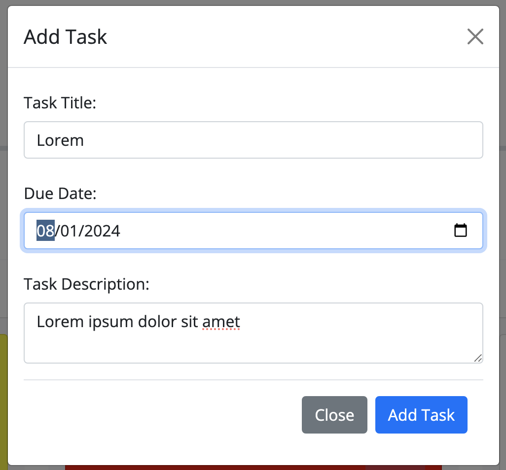
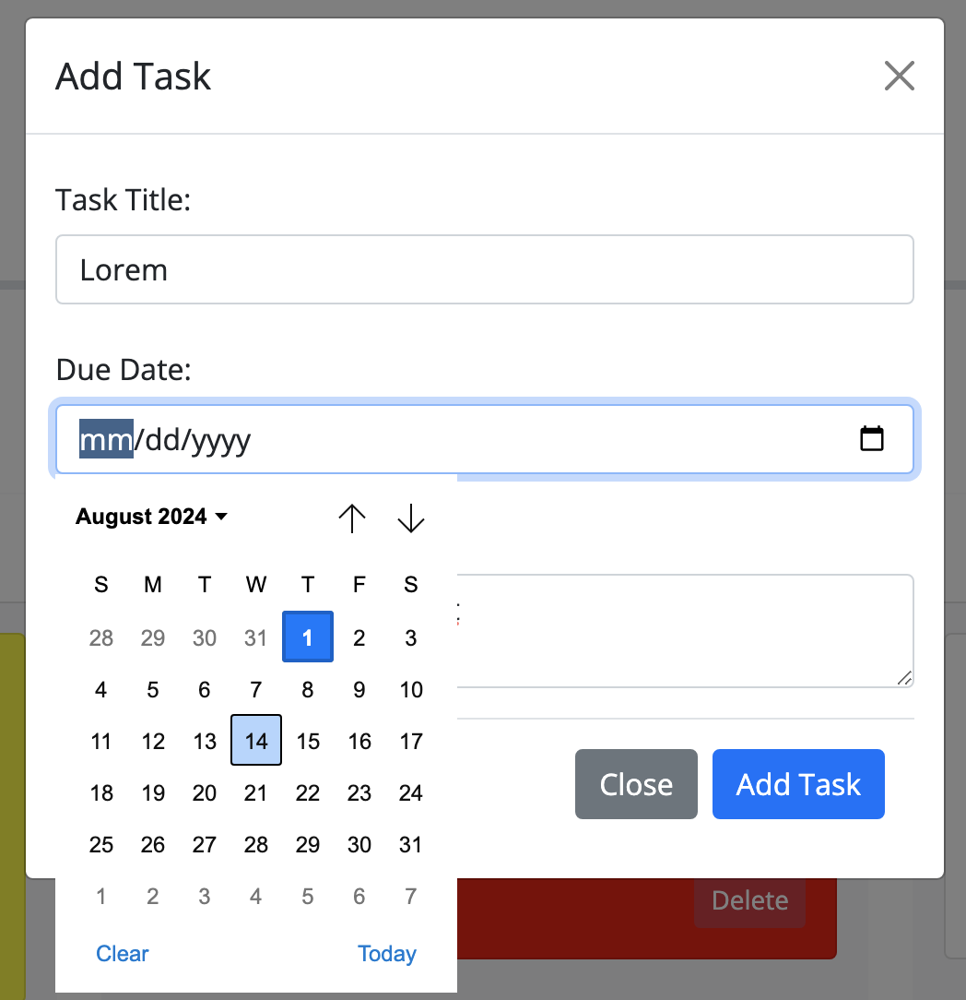
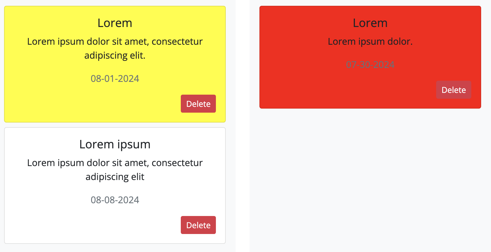
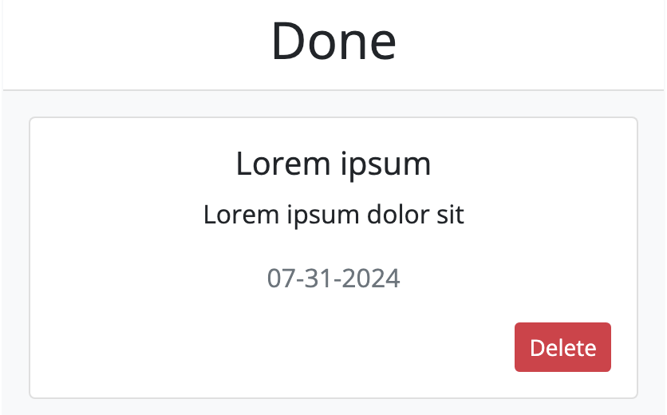
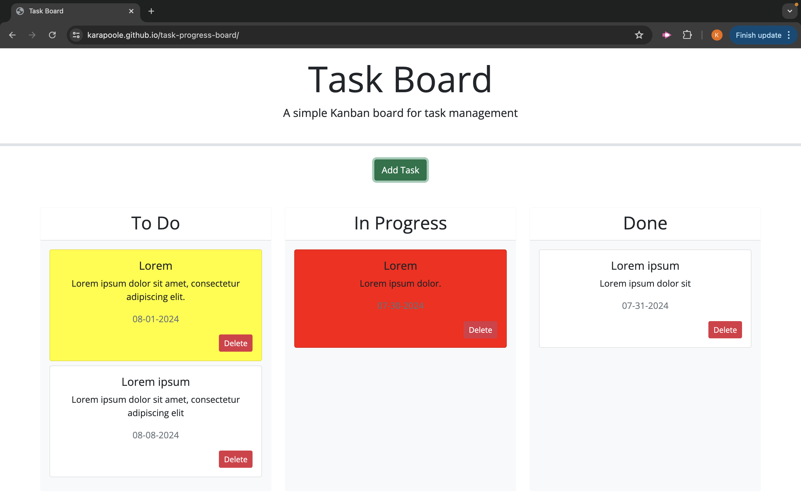

# <Task-Progress-Board>

## Description

The purpose of this project was to create a task board application by modifying starter code. In order to use the task board, users click the “add task” button to add “task cards” to the board that include a task title, date, and description. Users enter this information through a modal.

The task board includes three distinct columns to display task cards, including “to do,” “in progress,” and “done.” Users can drag task cards between these columns to indicate the task’s status.

When the user creates a task card, they are able to use a date picker to input the due date for the card. Additionally, the card is color coded so that tasks that are 4 days away from their deadline (nearing deadline) are yellow and overdue tasks are red. When a card is dragged to the “done” column, the color of the card turns back to white.

The data the user creates for each card is saved in local storage. Upon refreshing the page, the application retrieves all previous cards from local storage so that the cards are still on the page for the user. Each card has a delete button, and when pressed by the user, the card is deleted from local storage and no longer displayed on the page.

## Table of Contents

If your README is long, add a table of contents to make it easy for users to find what they need.

- [Usage](#usage)
- [Application](#application)
- [Credits](#credits)
- [License](#license)

## Usage

### Modal

### Date Picker

### Color Coded Cards

### Overdue White Card in Done Column

## Application

### Deployed Application URL:

https://karapoole.github.io/task-progress-board/

### Deployed Application Screenshot:

## Credits

edX curriculum

## License

Please refer to license in repo.
